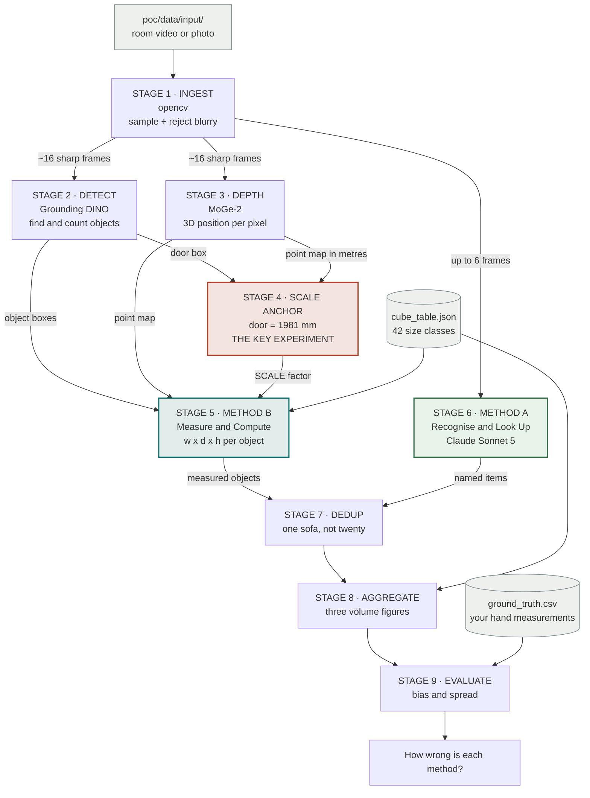

# POC Architecture

> **FILE PURPOSE** — The map. What we are building, which models do what, and what goes
> in and out of every stage. Read this before opening the notebook.
>
> Companion files: `GAPS.md` (open decisions) · `STATUS.md` (what is built) ·
> `poc/pipeline.ipynb` (the implementation)

---

## 1 · What the POC has to answer

> Point a camera at a room. Get back a list of what is in it and how many cubic metres it
> will take on a removal truck. **Then find out how wrong that answer is.**

That last sentence is the actual deliverable. Producing *a* number is easy; knowing how
much to trust it is the whole point.

---

## 2 · The two methods — the part that was unclear

There are two fundamentally different ways to get from a photograph to a volume. We do not
know which is better on our footage, so **we build both and race them once.**

### Method A · Recognise & Look Up

**Works like a surveyor with a clipboard.**

Look at the sofa. Decide *"that's a 3-seater."* Read the volume off a standard table:
`sofa_3_seat = 1.42 m³`. Write it down. Move on.

**It never measures anything.** The AI's only job is to put the right *name* on things.

### Method B · Measure & Compute

**Works like a surveyor with a tape measure.**

Work out the sofa is 2.08 m wide, 0.91 m deep, 0.86 m tall. Multiply. That is the volume.

**It never looks anything up.** The AI's only job is to *measure* accurately.

### Side by side

| | **Method A** | **Method B** |
|---|---|---|
| Mental model | surveyor with a clipboard | surveyor with a tape measure |
| The AI's job | name things correctly | measure things correctly |
| Core model | Claude Sonnet 5 (vision) | MoGe-2 (depth) |
| Needs the cube table? | **yes — completely dependent** | only for the final lookup |
| Needs to know scale? | **no** | **yes — and this is the hard part** |
| Fails when | the table is wrong, or the name is wrong | the scale is wrong, or the object is half hidden |
| Used by the industry? | **yes — all of them** | no product does this |
| Cost per room | ~$0.12 | ~$0 after setup |

### Why race them at all?

Because they fail for *different* reasons, and neither failure is obvious in advance.

- Method A inherits every error in the cube table. If NX's real 3-seater is 1.6 m³ and our
  table says 1.42 m³, Method A is 11% wrong **and cannot possibly detect it.**
- Method B inherits the depth model's scale error, published at **8.19%** — which becomes
  roughly **26% on volume**, because volume grows with the cube of length.

Every commercial product uses Method A. That is strong evidence, but it is *their* evidence,
not ours. One test settles it, then we delete the loser and stop paying for it.

---

## 3 · Pipeline overview

Plain-text version first, because VS Code's built-in Markdown preview does not render
Mermaid without an extension.

```
                    poc/data/input/  (room video or photo)
                                  |
              +-------------------v--------------------+
              |  STAGE 1 · INGEST            [opencv]  |
              |  sample frames, drop blurry/dark ones  |
              +-------------------+--------------------+
                                  |  ~16 sharp frames
        +-------------------------+-------------------------+
        |                         |                         |
        v                         v                         v
+---------------+     +-------------------+     +-------------------------+
| STAGE 2       |     | STAGE 3           |     | STAGE 6                 |
| DETECT        |     | DEPTH             |     | METHOD A                |
| Grounding     |     | MoGe-2            |     | Recognise & Look Up     |
| DINO          |     |                   |     | Claude Sonnet 5         |
|               |     | 3D position       |     |                         |
| boxes+labels  |     | per pixel (m)     |     | size class + count      |
+-------+-------+     +---------+---------+     +------------+------------+
        |                       |                            |
        |   +-------------------+                            |
        |   |                                                |
        v   v                                                |
+-------------------------------+                            |
| STAGE 4 · SCALE ANCHOR        |                            |
| door = 1981 mm -> correction  |                            |
| *** the key experiment ***    |                            |
+---------------+---------------+                            |
                | SCALE                                      |
        +-------v-------+                                    |
        | STAGE 5       |                                    |
        | METHOD B      |                                    |
        | Measure &     |                                    |
        | Compute       |                                    |
        | w x d x h     |                                    |
        +-------+-------+                                    |
                |                                            |
                +---------------+----------------------------+
                                |
                    +-----------v------------+
                    | STAGE 7 · DEDUP        |
                    | one sofa, not twenty   |
                    +-----------+------------+
                                |
                    +-----------v------------+     +----------------------+
                    | STAGE 8 · AGGREGATE    |<----+ cube_table.json      |
                    | three volume figures   |     | 42 size classes      |
                    +-----------+------------+     +----------------------+
                                |
                    +-----------v------------+     +----------------------+
                    | STAGE 9 · EVALUATE     |<----+ ground_truth.csv     |
                    | bias & spread          |     | YOUR hand measures   |
                    +-----------+------------+     +----------------------+
                                |
                     how wrong is each method?
```

Same thing as a rendered diagram (GitHub, or VS Code with a Mermaid extension):



---

## 4 · Stage by stage — input, implementation, output

| # | Stage | Input | Implementation | Output |
|---|-------|-------|----------------|--------|
| **1** | Ingest | one `.mp4`/`.mov`/`.jpg` | opencv. Sample 1 frame/sec, score sharpness (variance of Laplacian) and brightness, reject failures, cap at 16 | `frames` — list of `{t, img, sharp, bright}` |
| **2** | Detect | the frames | **Grounding DINO** with 26 plain-English phrases from `detect_vocab.json`. Open-vocabulary, so changing what we look for is a JSON edit, not retraining | `f["dets"]` — `{label, score, box}` per object per frame |
| **3** | Depth | the frames | **MoGe-2** (`Ruicheng/moge-2-vitl`). Predicts a metric point map plus camera intrinsics from a single image | `f["depth"]` — `points (H,W,3)` in metres, `depth`, `intrinsics`, `mask` |
| **4** | Scale anchor | door boxes + point maps | Measure the door's height in the point map, divide 1.981 m by it, take the median across frames | `SCALE` — one float applied to every measurement |
| **5** | **Method B** | boxes + point maps + `SCALE` | Points inside each box → height from the vertical axis, width/depth from **PCA** on the footprint (so an angled sofa isn't measured too wide). Then match to the nearest size class | `MEAS` table — `w, d, h, bbox_m3, mapped_class` |
| **6** | **Method A** | up to 6 frames | **Claude Sonnet 5** with a forced tool schema whose `enum` is the cube table, so an invalid class is impossible | `per_frame_recognised` — `{size_class, count, confidence}` per frame |
| **7** | Dedup | both per-frame lists | `max` or `median` of per-frame counts per class. Zeros included, so a 1-in-8 false positive dies under `median` | `inv_recognised`, `inv_measured` |
| **8** | Aggregate | both inventories + cube table | Multiply counts by `cube_m3` and sum. Three figures | volumes in m³ and ft³ |
| **9** | Evaluate | `ground_truth.csv` | Precision/recall on the item list, volume **bias** split from **absolute error**, per-item dimension error | the answer |
| **A** | Appendix | nothing | Monte Carlo over simulated scale error | how much precision Method B needs |

---

## 5 · The models

| Model | Stage | Job | Licence | Why this one |
|-------|-------|-----|---------|--------------|
| **Grounding DINO**<br/>`IDEA-Research/grounding-dino-base` | 2 | Find and **count** objects from text prompts | Apache 2.0 | Open-vocabulary — no retraining to add an item type. **It does the counting, not the chat model.** |
| **MoGe-2**<br/>`Ruicheng/moge-2-vitl` | 3 | Metric depth: 3D position per pixel | **MIT** | Best *shippable* metric accuracy (8.19%). UniDepthV2 scores better but is CC BY-NC and could never ship — gap **B2** |
| **Claude Sonnet 5**<br/>`claude-sonnet-5` | 6 | Name each object's size class | commercial API | Strong at naming and context; forced tool output guarantees valid classes |

### Why the detector counts and the chat model does not

Measured counting accuracy for vision language models is about **0.53**, falling further
with several object types in frame. And it fails in the dangerous direction: it
**under-counts**, producing confident, plausible, *low* inventories — which become low
quotes and undersized trucks.

So the rule throughout: **the detector counts, the chat model names.**

---

## 6 · The scale problem, plainly

**A photograph does not know how big anything is.** A photo of a sofa and a photo of a
doll's sofa are geometrically identical images. Nothing in the pixels distinguishes them.

MoGe-2 guesses from experience — it has seen enough rooms to estimate that a sofa-shaped
thing is roughly sofa-sized. Its published error is **8.19%**.

Two consequences:

**It cubes.** Volume goes as length³, so a 8% length error is about **26% on volume.**

**It does not average out.** This is the part that surprises people. If the model reads the
room 8% too large, *every object in it* is 8% too large. There is **one** mistake, not a
hundred, so measuring more objects does not help at all. Ordinary detection noise averages
away across a house; scale error multiplies the whole shipment.

That is why **Stage 4 is the most important cell in the notebook**, and why a single
detected door is worth more than a better depth model.

### What the appendix already proved

Runs with no data. Class accuracy as scale error grows:

| Scale error | Candidates narrowed by detector | Searching all 42 classes |
|---|---|---|
| 0% | 99.2% | 97.7% |
| 5% | 94.5% | 85.1% |
| **8%** ← MoGe-2's real error | **90.2%** | **71.8%** |
| 15% | 77.5% | 50.8% |

**Roughly one point of class accuracy lost per point of scale error** — that is the
measurable return on the anchor work. And narrowing candidates by the detector label is
worth about **18 points**, so never match a measurement against the whole table.

---

## 7 · Worked example — one sofa, both routes

Illustrative numbers, to show the mechanics.

**Shared stages**

| Stage | What happens |
|---|---|
| 1 | Frame at `t=3.0s`, sharpness 142 — passes |
| 2 | Box `[412, 288, 901, 604]`, label `sofa`, score 0.71 |
| 3 | Pixels in that box sit 2.6–4.1 m from the camera |
| 4 | A door in the same frame measures **1.80 m**. Real doors are **1.981 m**. → `SCALE = 1.101` (everything was ~10% too small) |

**Then the paths split**

```
METHOD B · Measure & Compute            METHOD A · Recognise & Look Up
─────────────────────────────           ──────────────────────────────
points in box x 1.101                   send frame to Claude Sonnet 5
   height  (vertical axis)  0.86 m         |
   footprint (PCA)          2.08 x 0.91 m  v
   raw volume               1.72 m3      {"size_class": "sofa_3_seat",
   |                                       "count": 1,
   v                                       "confidence": 0.86}
nearest class among                        |
{2_seat, 3_seat, sectional}                v
   -> sofa_3_seat (dist 0.03)           cube_table -> 1.42 m3
   |
   v
cube_table -> 1.42 m3
```

Both land on 1.42 m³. **Now the interesting part — where they come apart:**

| Scenario | Method B | Method A |
|---|---|---|
| Sofa half behind a table | box is clipped, measures small, maps to `sofa_2_seat` → **1.0 m³, a 30% miss** | still reads "3-seater" from context → **correct** |
| No door in frame | no anchor, 8% scale error stands → **~26% volume error** | **unaffected** — it never used scale |
| Cube table wrong for NX | raw box volume is still independent evidence | **11% wrong and cannot detect it** |
| Unusual item not in the vocabulary | invisible | invisible (both fail — a vocabulary gap) |

This is the whole argument for building both. Stage 9 tells us which failure mode actually
dominates on real footage.

---

## 8 · How we decide the winner

Stage 9 prints two numbers per method. **Read them in this order:**

1. **`vol_bias_pct`** — is it consistently high or low? Consistent bias is one multiplier
   away from being fixed. Almost good news.
2. **`vol_abs_err_pct`** — how much does it vary job to job? Not fixable with a
   coefficient. The expensive problem.

**A method with large bias and small spread beats the reverse**, even if its raw error
looks worse. That is counter-intuitive and it is the single most important thing to
understand when reading the output.

Then run the notebook again with `use_scale_anchor = False` and diff. If the anchor buys
little, Method B's whole premise is weaker than expected.

---

## 9 · Deliberately not in the POC

Not oversights — tracked as Group C in `GAPS.md`:

carton and box counts · contents of closed cupboards · coverage enforcement ·
dismantling and fragile-packing rules · **browser upload UI** · authentication ·
persistence · back-office integration · GDPR controls · photo-archive security ·
self-pack vs full-pack · multi-room aggregation · confidence intervals and vehicle
planning · staff review console

The browser UI is deliberately last. It carries no technical risk and is about a day's work
once the pipeline produces a number worth showing.

---

## 10 · File map

| File | Purpose |
|------|---------|
| `ARCHITECTURE.md` | this file — the map |
| `GAPS.md` | 22 open decisions in three groups by when they must be answered |
| `STATUS.md` | what is actually built vs merely written |
| `poc/pipeline.ipynb` | the implementation, 9 stages + appendix |
| `poc/cube_table.json` | **name → volume.** Method A's entire brain. Placeholder — gap A3 |
| `poc/detect_vocab.json` | what the detector looks for, and which classes each phrase allows |
| `poc/ground_truth_template.csv` | schema for your hand measurements. Copy to `ground_truth.csv` |
| `poc/requirements.txt` | dependencies, including two licence-driven choices |
| `poc/setup.sh` | one-time environment setup. **Blocker #1** |
| `poc/README.md` | quick start |
