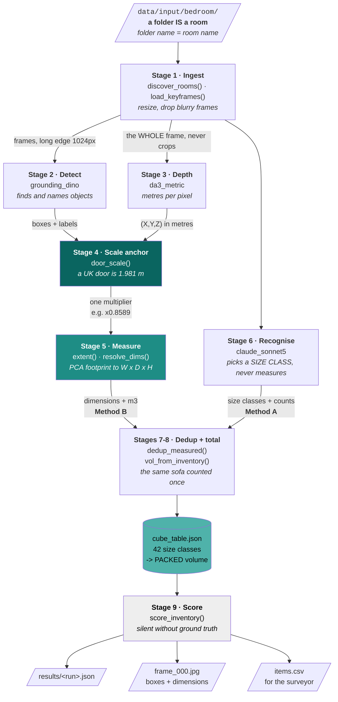
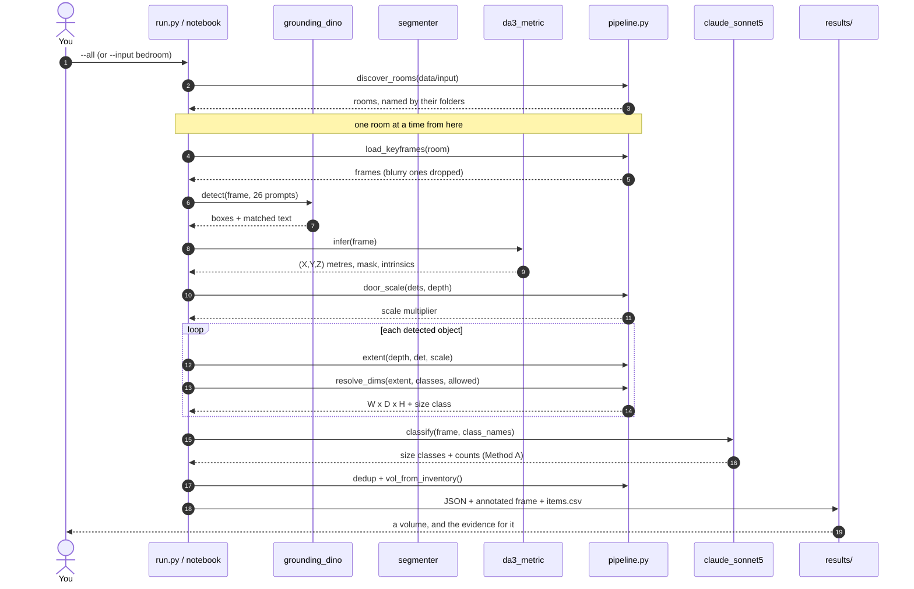

# grounding_dino__da3_metric__sonnet5 — system design

> **FILE PURPOSE** — How a photograph becomes a volume in this pipeline, stage by
> stage, with the intuition behind each step. Written to be read by someone who will
> not read the code. Generated by `poc/pipelines/make_diagram.py` — do not hand-edit.

<details>
<summary><b>The diagrams below look like code? Click here.</b></summary>

They are [Mermaid](https://mermaid.js.org/) — text that renders as a diagram. Where
it renders without you doing anything:

| where | works out of the box? |
|---|---|
| **GitHub**, viewing this file in the browser | **yes** — easiest way to check |
| GitLab, Notion, Obsidian | yes |
| **VS Code** Markdown preview | **no — needs an extension** |

For VS Code, install **Markdown Preview Mermaid Support**:

```
code --install-extension bierner.markdown-mermaid
```

or search `bierner.markdown-mermaid` in the Extensions panel. Then reopen the preview
with `Cmd+Shift+V`. Nothing else is required — no Node, no CLI.

Jupyter's built-in Markdown renderer does **not** do Mermaid. Notebook diagrams in
this project are drawn with matplotlib instead, for that reason.

</details>

**The question this pipeline answers:** Does Depth Anything 3's metric variant beat MoGe-2 on our footage?

| slot | model | licence |
|---|---|---|
| detector | `grounding_dino` — Grounding DINO (base) | Apache-2.0 |
| depth | `da3_metric` — Depth Anything 3 Metric-Large | Apache-2.0 |
| segmenter | _none — measures the whole box, background included_ | - |
| classifier | `claude_sonnet5` — Claude vision (claude-sonnet-5) | commercial API |
| scale anchor | door, 1.981 m | — |

---

## 1 · The idea in one paragraph

A photograph gives you pixels. A quote needs cubic metres. Getting from one to the
other takes two independent routes, because each fails where the other works.
**Method B measures**: a depth model turns pixels into metres, and geometry turns
metres into width, depth and height. **Method A recognises**: a vision model names
each object's *size class*, and a lookup table turns that class into the volume the
object occupies **once packed** — which is not the same as its measured volume, since
a rug ships rolled. When the two agree you can quote; when they disagree you have
found a room that needs a human. That, not a single accuracy number, is the product.

---

## 2 · The data flow



---

## 3 · Step by step, and why each step exists

| # | Stage | In | Out | Why it exists |
|---|---|---|---|---|
| 1 | **Ingest** `discover_rooms()` `load_keyframes()` | `data/input/` | the rooms, then frames at 1024 px with blurry ones dropped | **A sub-folder is a room and its name is the room name**, so four folders is a four-room house and every report says which room it describes. Stages 7-8 count each item once *per room*, so the code has to know which photographs belong together — a folder is how you tell it. Everything downstream is in **pixels** until stage 4, so frames must be a consistent size; blur wrecks detection and depth alike, so it is filtered before a model sees it. |
| 2 | **Detect** `grounding_dino` | frame + 26 prompts | boxes + matched text | An open-vocabulary detector returns *matched text*, not a class id, so the label is normalised to one prompt. Where it cannot pick one it returns **no** label rather than guessing — a wrong label forces the wrong size class whatever the geometry says. |
| 3 | **Depth** `da3_metric` | the **whole** frame | (X,Y,Z) in metres per pixel | Run on the full frame, never the crops — these models reason from scene context, and cropping destroys the geometry they use to infer scale. The metres are *claimed*: about 8% error. |
| 4 | **Scale anchor** `door_scale()` | boxes + depth | one multiplier | The highest-leverage stage. Depth error is **one multiplier on the whole room**, not noise that averages out — and volume goes as length cubed, so 16% on length is 58% on volume. A door is a known 1.981 m, so it calibrates everything at once. |
| 5 | **Measure** `extent()` `resolve_dims()` | box + depth + scale | W x D x H + m3 | PCA on the horizontal footprint finds the object's *own* axes — a sofa at 30° is 2.2 m long, not 2.5 m of diagonal. A camera never sees the back of a wardrobe, so when depth is unobservable a class prior is substituted and `depth_source` says so. |
| 6 | **Recognise** `claude_sonnet5` | the frame | size classes + counts | Names the SIZE CLASS, never measures. "sofa" does not set a volume — sofa_2_seat 0.99 m3 vs sofa_sectional 2.27 m3 is a 2.3x spread, and choosing between them *is* the quote. Not used for counting: VLM counting accuracy is ~0.53 and under-counts. |
| 7-8 | **Dedup + total** | all rows | one inventory + volumes | The same sofa appears in six frames and must count once. Then each object is replaced by its cube-table class, because **packed volume is a property of the class**, not of the measurement. |
| 9 | **Score** `score_inventory()` | inventory + ground truth | bias, error, precision, recall | **Silent unless `poc/ground_truth.csv` exists.** Without hand-measured rooms the pipeline can report what it believes, never whether it is right. Gap **A1**. |

---

## 4 · Call order



---

## 5 · Where this pipeline goes wrong — what to watch

| Symptom in the output | What it means | What to do |
|---|---|---|
| `labels: N ambiguous` | `text_threshold` too LOW — prompts fused into one span | raise `TEXT_TH` in `config.py` |
| `labels: N empty` | `text_threshold` too HIGH — no token cleared it | lower `TEXT_TH` |
| `SCALE=1.0  [no door found]` | **no calibration happened** — raw ~8% depth error, ~26% on volume, flows into the quote | get a door in frame, or accept the error explicitly |
| `class_prior_pct` above 60 | Method B is mostly reading the cube table, so it is no longer independent of Method A | their agreement stops being evidence |
| raw m3 far above class-snapped | boxes contain wall and floor | add a segmenter — `grounding_dino__moge2__sam2__sonnet5` |
| a 1.7 m deep sofa in `items.csv` | over-measurement: background inside the box | look at `frame_000.jpg` — this is exactly what it is for |

**Read the annotated frame, not just the JSON.** Every real bug found so far — a 19%
over-estimate from a mislabelled coffee table, a door-anchor percentile error, an
unnamed-duplicate double count — looked perfectly plausible in the numbers and was
obvious the moment the boxes were drawn on the photograph.

---

## 6 · The honest limitation

This pipeline reports what it **believes**. Nothing in it establishes whether it is
**right**. `HomeObjects-3K` scores detection only; `NYU Depth V2` can score depth; but
neither carries the *packed volume* of a real room, and that is the number the client quotes.

Until 3-5 rooms are measured by hand into `poc/ground_truth.csv`, every figure here is
a demonstration, not a measurement. That is gap **A1** in `GAPS.md`, and no amount of
further modelling substitutes for the tape measure.
